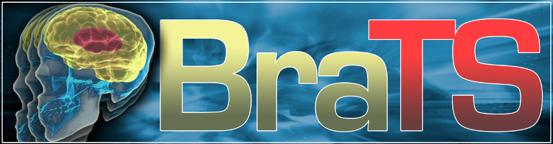
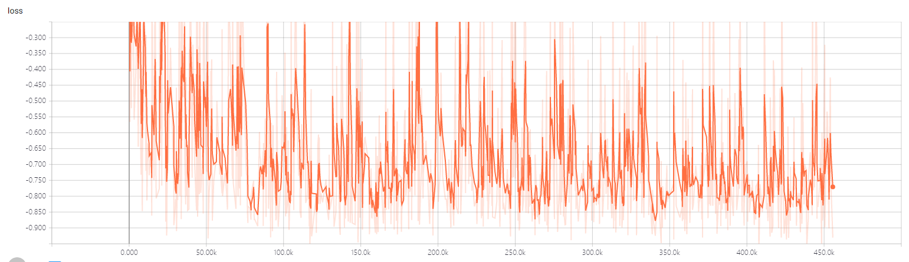
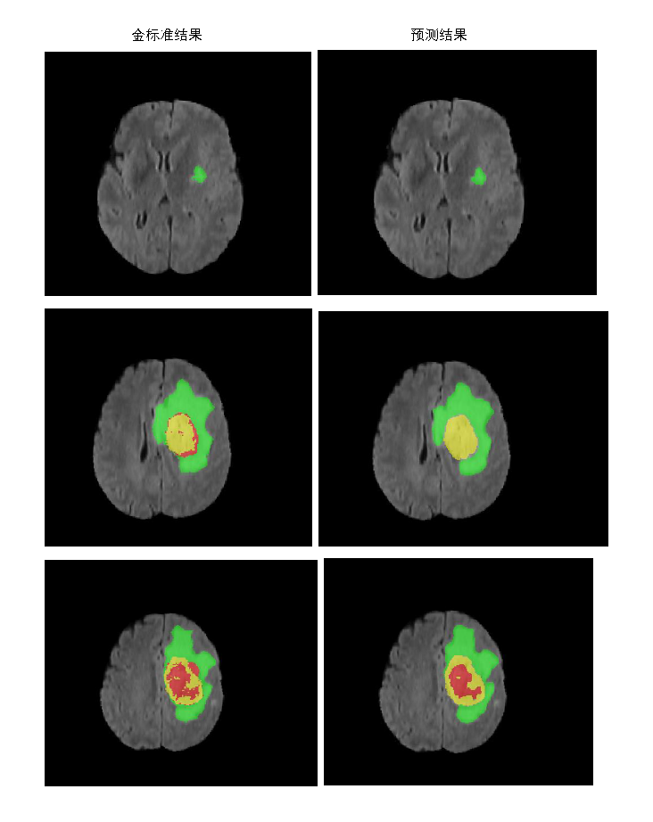

# BraTS18——Multimodal Brain Tumor Segmentation Challenge 2018
> This is an example of the MutiModal MRI images Brain Tumor Segmentation

## Prerequisities
The following dependencies are needed:
- numpy >= 1.11.1
- SimpleITK >=1.0.1
- opencv-python >=3.3.0
- tensorflow-gpu ==1.8.0
- pandas >=0.20.1
- scikit-learn >= 0.17.1

## How to Use

**1、Preprocess**

* analyze the MutiModal MRI image message and Mask image label:run the dataAnaly.py function of getMaskLabelValue() and getImageSizeandSpacing().
* MutiModal Brain Tumor MRI images have fixed size (240,240,155).
* generate patch(128,128,64) tumor image and mask for Tumor Segmentation:run the data3dprepare.py.
* save patch image and mask into csv file: run the utils.py,like file trainSegmentation.csv.
* split trainSegmentation.csv into training set and test set:run subset.py.

**2、Brain Tumor Segmentation**
* the VNet model

 

* Tumor Segmentation training:run the train_Brats.py.
* Tumor Segmentation inference:run the predict_Brats.py.

## Result

* the train loss

## Contact
* https://github.com/junqiangchen
* email: 1207173174@qq.com
* Contact: junqiangChen
* WeChat Number: 1207173174
* WeChat Public number: 最新医学影像技术
